# Issue 3 — Modernism, Postmodernism, and Visual Language

Visual design does more than make information easier to see. It can make an object feel rational, familiar, luxurious, playful, strange, trustworthy, local, universal, serious, or ironic. Those meanings are not carried by words alone. They are built through decisions about type, spacing, alignment, image, color, scale, repetition, material, and omission.

This chapter introduces two large and influential design traditions—**modernism** and **postmodernism**—as ways of thinking about those decisions. The point is not to memorize two opposing styles. The point is to learn how visual language can carry ideas about order, culture, identity, authority, function, and expression.

A useful starting question is:

> **What is this design asking me to believe about the thing it represents?**

---

## A Short Historical Path into Modernism

Modernism was not one style that appeared on one date. It was a loose family of ideas that developed across art, architecture, typography, photography, industrial design, and other fields. The Victoria and Albert Museum describes modernism as a broad movement that rejected many inherited styles and sought new approaches to a rapidly changing world. In Europe and elsewhere, industrialization, new technologies, mass production, urbanization, political upheaval, and the experience of the First World War all helped make older visual conventions feel less inevitable. [V&A, *What was Modernism?*]

Before modernist graphic design, printed communication often relied heavily on ornament, historical typefaces, centered compositions, decorative borders, and conventions inherited from earlier periods. Modernist designers increasingly asked whether form could be reorganized around the needs of the message itself.

Several related movements contributed to this shift. Constructivism emphasized geometry, photography, photomontage, and dynamic composition. De Stijl explored geometric abstraction and visual order. The New Typography, associated especially with Jan Tschichold in the 1920s, challenged symmetrical page layouts in favor of asymmetry, open space, and clearer information structures. MoMA's account of *The New Typography* notes the influence of both Soviet design and the Bauhaus on this change. [MoMA, *The New Typography*]

Modernism therefore did not begin with a blank page. It was a process of **reconsidering inherited visual rules**.

---

## Bauhaus

The **Bauhaus** school was founded in Weimar in 1919 by Walter Gropius. It later moved to Dessau and then Berlin before closing in 1933. Its importance lies not only in a recognizable look of circles, squares, sans-serif type, and geometric forms, but also in an educational idea: art, craft, materials, technology, and production could be studied together.

The Bauhaus is often reduced to a formula such as “form follows function,” but that simplification can hide how experimental the school actually was. Workshops investigated materials and processes, and designers considered how objects might be produced and used at scale. The Met's historical account emphasizes the school's changing attention to mass production, social function, typography, photography, and visual clarity. [The Metropolitan Museum of Art, *The Bauhaus, 1919–1933*]

Typography became increasingly important at the Bauhaus. Designers such as **László Moholy-Nagy** and **Herbert Bayer** treated typography as both communication and visual composition. Bayer's work pushed toward sans-serif typography, asymmetry, photography, and a more systematic organization of information. MoMA's collection record for one of Bayer's 1926 posters describes its underlying grid, asymmetrical composition, and emphasis on clarity. [MoMA, Herbert Bayer, *Architektur Lichtbilder Vortrag Professor Hans Poelzig*]

The lesson for a student is not “make everything geometric.” The deeper lesson is:

**Design can be a system for making relationships visible.**

A chair can reveal how it is meant to be sat in. A poster can reveal what to read first. A page can reveal how one piece of information relates to another. A product interface can reveal where an action begins and where it ends.

---

## Swiss / International Typographic Style

After the Second World War, a highly influential approach to graphic design developed in Switzerland and spread internationally. It is commonly called the **Swiss Style** or **International Typographic Style**. Cooper Hewitt describes it as emerging in Switzerland during the 1940s and 1950s, with a strong emphasis on typography, sans-serif type, asymmetrical layouts, grids, and photography. The V&A similarly notes the movement's association with simple geometry and uncluttered clarity. [Cooper Hewitt, *A Harmony of Contrasts*; V&A, *A Short History of the Poster*]

Important designers associated with this tradition include **Josef Müller-Brockmann**, **Armin Hofmann**, and **Max Bill**. Their work often uses a grid not merely as a hidden production aid but as a visible logic for arranging information.

The result can feel calm because the viewer can sense the organizing rules. Elements line up. Type sizes repeat according to a hierarchy. Images occupy deliberate positions. White space separates groups. A sans-serif typeface may reduce stylistic distraction so that the information structure becomes easier to perceive.

But the grid is more than a neat appearance. It is a way of making decisions repeatable.

> **A grid is a design tool for relationships, not a guarantee of good design.**

This distinction matters. A grid can create clarity, but it can also become formulaic. A designer can follow a grid while still producing a confusing hierarchy, weak contrast, or an inappropriate visual tone.

---

## Modernist Principles

Modernist design is best understood as a set of recurring priorities rather than a single visual recipe. Five are especially useful for reading graphic and digital work.

### Grid

A **grid** establishes a structure for alignment. It can be explicit, as in visible columns, or invisible, as in repeated margins and spacing rules.

Ask:

- What is aligned with what?
- Where do columns begin and end?
- Are repeated elements following a rule?
- Does the structure help me predict where information will appear?

### Hierarchy

**Hierarchy** tells the viewer what to notice first, second, and third. Scale, weight, position, contrast, spacing, and repetition can all create hierarchy.

A strong hierarchy can make a complex message feel simple because the viewer does not have to treat every element as equally important.

### Clarity

**Clarity** means that the visual organization supports comprehension. It does not necessarily mean that the design is plain or boring. A highly expressive poster can still have a clear reading path.

### Reduction

**Reduction** removes elements that do not contribute to the message or function. This is related to ideas of economy, but reduction is not the same thing as emptiness. White space, limited type choices, and simple shapes can become active parts of the communication system.

### Function

**Function** asks what the design needs to do in use. A transit sign, a medical form, a book cover, a chair, and a shopping interface have different functional demands.

Modernist thinking often assumes that visual form should be accountable to purpose. But purpose is never completely neutral: deciding what counts as useful, essential, universal, or efficient is itself a cultural decision.

That observation becomes important when we turn to postmodernism.

---

## From Modernist Certainty to Postmodern Plurality

By the 1960s, 1970s, and 1980s, many designers and artists questioned whether one visual system could serve everyone, everywhere, all the time.

Postmodern design is not one unified style, and it did not simply “replace” modernism. It is better understood as a collection of challenges to modernist certainty. Some designers questioned universal rules. Others questioned the idea that decoration was merely unnecessary. Others brought historical references, popular culture, humor, appropriation, contradiction, or deliberate visual noise into professional design.

Where modernism often sought **order**, postmodern design could allow **disruption**.

Where modernism could favor **universality**, postmodern design could foreground **identity and difference**.

Where modernism could treat typography as an efficient carrier of information, postmodern designers could make typography behave like image, texture, voice, or performance.

Where modernism could value restraint, postmodern work could use **abundance**.

Where modernism could suggest that the design should disappear behind the message, postmodern design could make the act of designing itself highly visible.

Museum collections make these shifts easier to see. For example, MoMA describes Paula Scher's *The Diva is Dismissed* (1994) as using unusual spacing, mixed type weights, historic typefaces, and an expressive approach associated with postmodern or New Wave graphic design. MoMA's record of April Greiman's *DOES IT MAKE SENSE?* (1986) similarly describes a move away from clean Swiss conventions toward a digital aesthetic and experimentation with the computer as a design tool. [MoMA, Paula Scher, *The Diva is Dismissed*; MoMA, April Greiman, *DOES IT MAKE SENSE?*]

### The Postmodern Vocabulary

**Plurality** — Many visual languages can coexist. A designer does not have to pretend that one formal system is culturally neutral.

**Irony** — A design can say one thing while signaling another. It can imitate an established style while also commenting on it.

**Disruption** — Misalignment, awkward scale, unexpected cropping, visual noise, or broken patterns can become purposeful communication.

**Quotation** — Historical styles can be reused, sampled, exaggerated, or recombined rather than treated as finished chapters of history.

**Expressive typography** — Type can communicate through personality, movement, texture, rhythm, and reference as well as through literal words.

Postmodernism therefore expands the question from **“Is this organized correctly?”** to **“Why should this be organized this way, and what cultural assumptions does that organization carry?”**

---

## The Tension Does Not End

It is tempting to draw a neat historical line:

> modernism → postmodernism → now

Real design history is messier. Modernist systems never disappeared, and postmodern strategies did not become a universal replacement. Contemporary designers routinely combine them.

A product interface may use a strict grid, restrained color palette, and consistent spacing system while also using an oversized variable typeface or animated transition for personality. A fashion site may present an aggressively editorial image, broken typography, and asymmetrical layout while relying on an extremely systematic design system underneath. A financial dashboard may use highly ordered information architecture but introduce bright, playful graphics to make a stressful task feel less severe.

The same tension appears in branding:

| Tension | More modernist tendency | More postmodern tendency | Contemporary digital example |
|---|---|---|---|
| **Order ↔ disruption** | Consistent spacing and alignment | Deliberate collisions, overlap, or broken alignment | A dashboard with a stable grid but intentionally oversized campaign moments |
| **Universality ↔ identity** | Neutral-looking system intended for broad use | Local references, subcultures, personal voice | A global product with region-specific illustration, language, and imagery |
| **Clarity ↔ expression** | Typography optimized for quick scanning | Typography treated as image or personality | A landing page that keeps navigation clear while using expressive display type |
| **Grid ↔ anti-grid** | Modular columns and repeated intervals | Free positioning, asymmetry, or controlled misalignment | Editorial web layouts that shift between structured content and art-directed sections |
| **Restraint ↔ abundance** | Limited type, color, and imagery | Layering, collage, visual density | A minimalist checkout flow paired with a maximalist seasonal campaign |
| **Function ↔ irony** | Interface conventions that behave predictably | Familiar conventions quoted or intentionally twisted | A button, label, or interaction designed to reference older software or media |

The important word here is **tension**. Contemporary design often moves back and forth across these pairs rather than choosing one side permanently.

---

## A Timeline of Visual Language

```mermaid
flowchart LR
    A[Early modern design shifts<br/>late 19th–early 20th century] --> B[Avant-garde experiments<br/>Constructivism, De Stijl, New Typography]
    B --> C[Bauhaus<br/>1919–1933]
    C --> D[Swiss / International<br/>Typographic Style<br/>1940s–1960s]
    D --> E[Modernist systems spread<br/>corporate identity, information design]
    E --> F[Questions about universality<br/>and formal restraint]
    F --> G[Postmodern / New Wave<br/>1970s–1990s]
    G --> H[Plurality, quotation,<br/>irony, expressive type]
    H --> I[Digital design<br/>1990s–present]
    I --> J[Contemporary hybrid systems<br/>grids + disruption + identity]
```

The timeline is intentionally simplified. It shows a sequence of influential tendencies, not a single straight line of progress. Many movements overlapped, resisted one another, or developed in different places at different speeds.

---

## How to Read a Design

When you look at a poster, package, website, app screen, or product photograph, do not begin with “I like it” or “I don't like it.” Begin by describing what the design is doing.

### 1. Find the structure

Look for alignment, columns, margins, repetition, grouping, and spacing.

**Question:** What system seems to hold the composition together?

### 2. Find the hierarchy

Identify the first thing your eye notices. Then identify what you notice next.

**Question:** How does the design control sequence and attention?

### 3. Find the exceptions

Look for the element that does not follow the apparent rule.

**Question:** Is the exception accidental, functional, emotional, or expressive?

### 4. Identify the visual voice

Look at typeface, image style, color, material, texture, motion, and language.

**Question:** What kind of person, organization, community, or era does this design appear to speak for?

### 5. Ask what has been removed

Minimal-looking design is partly defined by absence.

**Question:** What information, decoration, texture, or reference has the designer chosen not to include?

### 6. Ask what has been quoted

A design may borrow from a historical advertisement, computer interface, newspaper, luxury brand, punk flyer, scientific diagram, or other visual tradition.

**Question:** What earlier language is being reused, and does the reuse feel sincere, nostalgic, humorous, critical, or simply familiar?

### 7. Connect form to function

Finally, ask what the design needs to accomplish.

**Question:** Do the visual choices help the intended action, or are they deliberately making the action more difficult in order to create a particular experience?

A useful reading sentence is:

> **This design uses [formal choice] to make [message, action, or identity] feel [effect], which places it closer to [a modernist, postmodern, or hybrid strategy] because [evidence].**

This keeps analysis grounded in what you can actually observe.

---

## The Plain White T-Shirt: Same Product, Different Visual Language

Return to the plain white T-shirt. The physical object can remain exactly the same: white cotton, simple cut, no visible graphic.

A **modernist presentation** might place the shirt against a clean background, photograph it front-on, use a restrained sans-serif typeface, provide exact measurements, and organize the information in a quiet grid. The copy might emphasize material, fit, construction, and useful facts. The product feels dependable, universal, and designed around function.

A **postmodern presentation** could use the same shirt but photograph it through a distorted lens, crop it unexpectedly, combine it with historical references, interrupt the typography, or place the product inside a deliberately artificial visual world. The copy might play with contradiction or irony. The shirt could suddenly feel like a cultural reference rather than a neutral utility.

Nothing about the cotton has changed.

The **visual language has changed the meaning of the object**.

This is one of the most important ideas in design: presentation does not merely decorate a product after the fact. It helps construct what the product is understood to be.

---

## Museum Research

Historical design is easiest to understand when you look at real objects rather than only reading summaries. Museum records can reveal dates, materials, makers, dimensions, exhibition histories, and curatorial interpretations that are difficult to see in a textbook image.

Start with museum and institutional collections such as:

- **The Metropolitan Museum of Art (The Met)** — search for Bauhaus, typography, graphic design, posters, modernism, and individual designers.
- **The Museum of Modern Art (MoMA)** — search for Bauhaus, New Typography, International Typographic Style, Swiss graphic design, postmodern graphic design, Paula Scher, April Greiman, and related designers.
- **Cooper Hewitt, Smithsonian Design Museum** — search for Swiss Style, grids, typography, posters, identity systems, and design histories.
- **Victoria and Albert Museum (V&A)** — search for modernism, posters, typography, graphic design, and twentieth-century visual culture.
- **Bauhaus archives and museums** — search for Bauhaus workshops, typography, weaving, photography, architecture, and student exercises.

### Search like a researcher

Do not search only for “famous Bauhaus design.” Search for specific combinations such as:

- `Bauhaus typography Herbert Bayer museum collection`
- `Bauhaus poster photography museum collection`
- `International Typographic Style grid Armin Hofmann collection`
- `Josef Müller-Brockmann grid poster museum`
- `Swiss Style sans serif photography poster collection`
- `postmodern graphic design typography museum collection`
- `Paula Scher poster MoMA collection`
- `April Greiman digital typography museum collection`

When you find an object, **verify the object record yourself**. Check the institution, title, designer, date, medium, object number, and any curatorial notes. Do not assume that an image circulating online is correctly attributed.

For your notes, record:

1. **What is it?** Title, designer, date, medium, and institution.
2. **What do you actually see?** Describe alignment, hierarchy, type, image, color, spacing, material, and scale.
3. **What system does it use?** Grid, repetition, symmetry, asymmetry, reduction, layering, collage, quotation, or something else.
4. **What does the institution say?** Compare your visual reading with the museum's description.
5. **What remains uncertain?** Record questions instead of filling gaps with guesses.

This approach turns museum browsing into visual research rather than image collecting.

### Research caution

Museum collections are not neutral lists of everything that has ever been designed. They are curated selections. Use them as authoritative sources for the objects they document, while remembering that design history also includes commercial work, local practices, vernacular design, under-documented communities, and objects that were never collected by major institutions.

---

## A Useful Comparison

| Question | Modernist approach | Postmodern approach |
|---|---|---|
| What makes a design convincing? | A coherent system and clear communication | A compelling voice, reference, contrast, or point of view |
| What is a grid for? | To organize relationships and produce consistency | To follow, expose, bend, or break as needed |
| What should typography do? | Support clear hierarchy and communication | Communicate information while also expressing personality, history, or attitude |
| What counts as visual economy? | Removing unnecessary elements | Choosing elements deliberately, even when the result is dense |
| How is history treated? | Often as something to move beyond through new forms | Often as a resource to quote, remix, parody, or revive |
| How should a viewer feel? | Oriented, informed, and able to act | Oriented, surprised, amused, challenged, or made aware of the design itself |
| What is the risk? | Sterility, sameness, false neutrality | Confusion, self-consciousness, or style replacing substance |

Neither column is a rulebook. Both are toolkits for making and interpreting choices.

---

## What You Should Remember

1. **Modernism was a broad historical project, not a single visual style.** Designers were responding to new technologies, social conditions, industrial production, and changing ideas about art and usefulness.
2. **The Bauhaus connected making, materials, teaching, technology, and visual communication.** Its legacy is larger than its familiar geometric appearance.
3. **Swiss / International Typographic Style made structure highly visible.** Grid, hierarchy, sans-serif typography, photography, and asymmetry became powerful tools for organizing information.
4. **Postmodern design challenged the assumption that one rational visual language could be universal.** Plurality, irony, quotation, disruption, and expressive typography became legitimate design strategies.
5. **The old conflict is still active.** Contemporary interfaces, websites, brands, and products continually negotiate order versus disruption, universality versus identity, clarity versus expression, grid versus anti-grid, restraint versus abundance, and function versus irony.
6. **Visual language changes meaning.** The plain white T-shirt can feel universal and functional in one presentation and ironic, cultural, or expressive in another—even when the physical shirt is identical.

The goal is not to decide whether modernism or postmodernism is “better.” The goal is to learn to see **which visual ideas a design is using, what those ideas make possible, and what they leave out**.

---

## Selected Institutional References Consulted

- Victoria and Albert Museum (V&A), *What was Modernism?*
- Victoria and Albert Museum (V&A), *A Short History of the Poster*
- The Metropolitan Museum of Art, *The Bauhaus, 1919–1933*
- The Museum of Modern Art (MoMA), *The New Typography*
- MoMA collection records for Herbert Bayer, Paula Scher, and April Greiman
- Cooper Hewitt, Smithsonian Design Museum, *A Harmony of Contrasts*
- Bauhaus-Archiv / Museum für Gestaltung, institutional materials on the Bauhaus and its collections

These references are provided as research starting points, not as a substitute for checking the current museum object records yourself.
