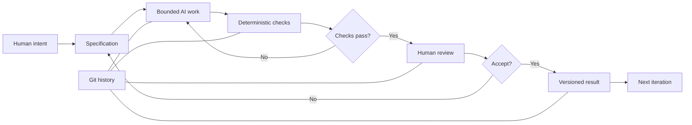

# Issue 5 — From Creative Idea to Controlled AI Work

A good creative brief tells you what you want.

A good AI workflow also tells the machine **where it is allowed to go, how you will check its work, and when a human must take over.**

That distinction matters because AI can generate persuasive copy, brand directions, layouts, code, documentation, diagrams, and countless variations very quickly. Speed is useful. Unbounded speed is not.

The earlier chapters gave us three lenses for thinking about creative direction:

- **Persuasion:** What response are we trying to enable?
- **Archetype:** What meaning or identity are we expressing?
- **Design language:** How should that meaning look and feel?

This final chapter turns those lenses into a practical control framework for AI-assisted work.

---

## 1. Three Lenses, One Direction

Imagine asking an AI:

> “Make this brand more compelling.”

That instruction is short, but it is weak.

Compelling to whom?

Compelling in what way?

What response should happen?

What kind of identity should the brand express?

What should the resulting work look and feel like?

A better instruction separates those questions.

### Persuasion asks: What response are we trying to enable?

Persuasion is about the intended response.

That response might be:

- curiosity,
- trust,
- recognition,
- understanding,
- confidence,
- exploration,
- action,
- or another clearly defined response.

This does not mean that persuasion guarantees an outcome. Human beings interpret messages in their own ways.

For AI direction, the useful move is to specify the **intended response** rather than merely requesting something “effective.”

Instead of:

> Make this landing page persuasive.

Try:

> Help a first-time reader understand the product quickly, see why it is relevant to their problem, and know what action to take next. Avoid pressure tactics and unsupported claims.

The second instruction gives the AI something concrete to optimize for.

---

## 2. Archetype Asks: What Meaning or Identity Are We Expressing?

The archetype provides a recognizable personality.

An Explorer might emphasize:

- independence,
- discovery,
- movement,
- possibility.

A Sage might emphasize:

- knowledge,
- clarity,
- evidence,
- understanding.

An Outlaw might emphasize:

- challenge,
- disruption,
- rule-breaking,
- provocation.

An Everyman might emphasize:

- familiarity,
- belonging,
- accessibility,
- ordinary life.

An archetype is therefore useful as a **semantic constraint**.

It helps prevent an AI system from wandering between incompatible personalities.

For example:

> Use an Explorer archetype. The product should feel like a capable companion for someone who values movement and independence. Avoid luxury-status language.

That is much more actionable than:

> Make it adventurous.

---

## 3. Design Language Asks: How Should the Meaning Look and Feel?

Design language translates the conceptual direction into visible and sensory decisions.

It can specify:

- typography,
- composition,
- imagery,
- color relationships,
- spacing,
- material references,
- texture,
- motion,
- interface behavior,
- editorial tone,
- and the level of visual restraint.

Again, specificity helps.

Compare:

> Make the page modern.

with:

> Use a restrained modernist language: strong grid, generous negative space, clear typographic hierarchy, limited decorative elements, precise alignment, and documentary product photography.

The second instruction describes a system rather than a mood word.

The AI now has boundaries to work inside.

---

# 4. The Three-Lens Prompt

The three lenses can be combined into one compact directing pattern:

> **Persuasion:** What response should the work enable?  
> **Archetype:** What meaning or identity should it express?  
> **Design language:** What should that meaning look and feel like?

For example:

### Weak direction

> Create an exciting campaign for this product.

### Three-lens direction

> **Persuasion:** Help the audience feel curious enough to investigate the product without using urgency or exaggerated claims.  
>
> **Archetype:** Explorer — independent, curious, capable, and open to discovery.  
>
> **Design language:** Spacious documentary photography, functional typography, natural environments, restrained graphics, and a sense of movement.  
>
> Keep the physical product and its documented characteristics unchanged.

The AI still has creative freedom.

But it has **bounded creative freedom**.

That is the important idea.

---

# 5. Specification: The Fence Around the Work

AI performs best when the task has a clear boundary.

A specification is not necessarily a giant technical document. It can be a compact description of:

- the objective,
- the inputs,
- the required outputs,
- constraints,
- acceptance criteria,
- allowed assumptions,
- prohibited changes,
- and validation requirements.

Think of the specification as a fence around the creative field.

Inside the fence, the AI can explore.

Outside the fence, it should not improvise.

## A useful specification pattern

### Objective

What are we trying to accomplish?

### Inputs

What material is the AI allowed to use?

### Required output

What artifact must be produced?

### Constraints

What must remain unchanged?

### Acceptance criteria

What must be true for the result to count as complete?

### Validation

How will we check those conditions?

For example:

> Create five product headlines.  
> Use only the supplied product description.  
> Do not introduce unverified performance claims.  
> Each headline must be under ten words.  
> Include at least one Explorer-oriented option.  
> A deterministic check should verify word count.  
> A human should review meaning and truthfulness.

Notice what this does.

It separates **generation** from **judgment**.

---

# 6. Deterministic Checks: Cheap, Repeatable, Unemotional

Some questions do not require an AI.

If the requirement is mechanical, automate it.

Examples:

- Does the file exist?
- Is the filename correct?
- Is the output valid Markdown?
- Does a required heading exist?
- Does a Mermaid block exist?
- Are there exactly five items?
- Is a string under a specified length?
- Does a JSON document parse?
- Does the program compile?
- Do automated tests pass?
- Are required links present?

These are useful because the same test can run repeatedly and produce a consistent answer.

A deterministic check is not “smarter” than human judgment.

It is simply **cheap and repeatable**.

That makes it excellent for catching boring mistakes.

## The principle

> **Automate what can be checked mechanically.**

Do not spend human attention counting words when a script can do it in milliseconds.

Save human attention for questions that require interpretation.

---

# 7. Probabilistic Review: Useful, But Not an Oracle

AI review is different.

An AI can inspect a document and say:

- this section seems inconsistent,
- the tone appears to drift,
- a requirement may be missing,
- two concepts may overlap,
- a claim may deserve verification,
- the argument may be unclear.

That can be extremely useful.

But AI review is **probabilistic**.

A model can miss a problem.

It can flag something that is not actually a problem.

It can confidently misunderstand context.

It can also reproduce the assumptions built into the material it is reviewing.

Therefore:

> **AI review is evidence, not authority.**

Use it as another inspection layer.

Do not treat “the AI approved it” as equivalent to “the work is correct.”

---

# 8. Human Judgment Is a Different Layer

Some decisions are difficult to reduce to a test.

A human may need to decide:

- Is the meaning appropriate?
- Is the claim truthful?
- Does the work respect its audience?
- Is the tone culturally or contextually appropriate?
- Does the design actually communicate the intended idea?
- Has a metaphor crossed into deception?
- Is the result useful?
- Is this still the work we intended to make?

These are not merely formatting questions.

They are judgment questions.

That is why a robust AI workflow does not try to eliminate the human.

It **spends human attention where human judgment has the most value.**

---

# 9. The Race-Car Pit Stop

Imagine a race car completing lap after lap.

You would not ask the entire pit crew to inspect every tire, bolt, and fluid level after every few meters.

The car needs to keep moving.

But you also would not say:

> “The car is automated, so nobody needs to look at it.”

Instead, selected moments deserve deliberate inspection.

That is the useful metaphor for human review.

**Automation keeps the car running.**

**Deterministic checks catch routine faults.**

**AI review scans for patterns and possible problems.**

**The human pit stop is where someone deliberately looks at the thing that matters.**

The skill is not reviewing everything manually.

The skill is choosing **where review has the highest value**.

A human might inspect:

- the first complete draft,
- a major architectural change,
- a final public-facing claim,
- a risky interpretation,
- a visual concept before production,
- or the final release candidate.

The exact checkpoints depend on the project.

---

# 10. Version Control: Give AI Work a Memory

AI generation creates another problem: **version drift**.

Suppose you ask an AI to revise a document twenty times.

Which version was better?

What changed?

When did a requirement disappear?

Why was a section rewritten?

Can you return to yesterday's version?

Without version control, those questions become surprisingly difficult.

Git provides a practical answer.

A repository can preserve a history of changes so that the project has:

- traceability,
- comparison,
- recovery,
- collaboration,
- and a record of how the artifact evolved.

The point is not that Git makes AI output correct.

It makes change **observable and reversible**.

That distinction is important.

---

# 11. AI Should Generate Inside a Versioned System

A useful mental model is:

> **AI generates. Git remembers. Checks verify. Humans decide.**

Imagine an AI edits a chapter.

You can then inspect the diff.

Maybe the AI improved the prose but silently removed an acceptance criterion.

The change is visible.

You can reject it.

Or perhaps the AI produced three useful alternatives, and you want to keep one while preserving the others for comparison.

Version control makes that possible.

The more frequently AI is allowed to modify files, the more valuable this history becomes.

---

# 12. Specification + Checks + Review

These pieces solve different problems.

| Layer | Main question | Typical strength |
|---|---|---|
| **Specification** | What are we asking for? | Defines the boundary |
| **AI generation** | What candidate can we produce? | Speed and variation |
| **Deterministic checks** | Did mechanical requirements pass? | Repeatability |
| **AI review** | What possible issues or inconsistencies do we notice? | Pattern recognition |
| **Human review** | Is this actually acceptable? | Context and judgment |
| **Git/version control** | What changed, and can we recover it? | Traceability |

None of these layers replaces the others.

A specification without validation can be ignored.

Validation without a specification has nothing clear to validate.

AI review without human judgment can become over-trusted.

Human review without version history can become difficult to reproduce.

Version control without clear criteria can preserve a beautifully documented mess.

The strength comes from the **system**.

---

# 13. A Complete Workflow

The full workflow can be represented like this:



The important feature is the loop.

AI-assisted work is rarely:

> prompt → answer → done

It is more often:

> intent → specification → generation → checking → inspection → revision → versioned result

The workflow creates places where errors can be caught before they become expensive.

---

# 14. How to Direct AI With the Three Lenses

The framework becomes especially powerful when the creative lenses are written directly into the specification.

## Example: a campaign

### Human intent

We want a campaign that helps people understand a simple product without exaggerating what it can do.

### Persuasion

Enable curiosity and informed consideration.

### Archetype

Explorer.

### Design language

Spacious documentary imagery, functional typography, restrained graphics.

### Constraints

Do not invent product capabilities. Do not imply that buying the product creates an identity. Keep the product description unchanged.

### Required output

Three campaign concepts, each with a headline, short story, imagery direction, and ethical risk.

### Deterministic checks

- Three concepts exist.
- Every concept contains all required fields.
- No headline exceeds the specified word count.
- Required headings are present.

### AI review

Ask a second pass to identify contradictions, unsupported claims, and drift from the Explorer direction.

### Human review

Decide whether the concepts are truthful, coherent, culturally appropriate, and actually useful.

### Versioned result

Commit the accepted version and retain the history of revisions.

Now the AI has a creative playground.

But the playground has boundaries.

---

# 15. The Difference Between Direction and Control

It is tempting to think that a detailed prompt should specify everything.

That is usually not the goal.

Good direction leaves room for invention.

The specification should define **what must be true**, while the AI can often determine **how to get there**.

For example:

> The presentation must feel calm, knowledgeable, and precise.

is a useful high-level requirement.

You can then constrain the design language:

> Use a restrained modernist system with a strong grid, generous negative space, and clear hierarchy.

But you do not necessarily need to dictate the exact position of every element.

The goal is not to make the AI behave like a photocopier.

The goal is to make its creativity **legible and controllable**.

---

# 16. A Practical Prompt Template

When directing AI-assisted work, this structure is a useful starting point:

```text
OBJECTIVE
What are we trying to accomplish?

AUDIENCE
Who is the work for?

PERSUASION
What response are we trying to enable?

ARCHETYPE
What meaning or identity should the work express?

DESIGN LANGUAGE
How should that meaning look and feel?

INPUTS
What information may the AI rely on?

CONSTRAINTS
What must not change or be invented?

REQUIRED OUTPUT
What files, sections, or artifacts must be produced?

ACCEPTANCE CRITERIA
What must be true for the task to be complete?

DETERMINISTIC CHECKS
What can be verified mechanically?

PROBABILISTIC REVIEW
What should an AI reviewer inspect for?

HUMAN REVIEW
What requires deliberate human judgment?

VERSION CONTROL
Where should the accepted result be recorded?
```

This template works because it separates different kinds of decisions instead of collapsing them into one vague request.

---

# 17. The Deeper Lesson

The real skill is not “writing better prompts.”

It is **designing a better system for collaboration between humans and machines.**

The three creative lenses help define the direction:

- **Persuasion** gives the work a response to enable.
- **Archetype** gives it a meaning and identity.
- **Design language** gives that meaning a visible and experiential form.

The engineering and workflow layers then make that direction safer to execute:

- **Specification** defines the boundary.
- **Deterministic checks** catch mechanical failures.
- **AI review** identifies possible problems probabilistically.
- **Human review** supplies context, responsibility, and judgment.
- **Git** preserves the trail.

The result is not an AI that has become perfectly reliable.

It is a workflow that does not require the AI to be perfectly reliable.

That is a much more useful goal.

---

# Questions for Next Week

1. What parts of your current AI workflow are underspecified?
2. Which requirements could be converted into deterministic checks?
3. Which decisions genuinely require human judgment?
4. Where would an AI reviewer add useful evidence without becoming the final authority?
5. What should be recorded in Git so that a future version can be understood and recovered?
6. Can you describe one project using the three lenses: **Persuasion + Archetype + Design Language**?
7. Where might your chosen persuasive strategy become manipulative if it were pushed too far?
8. What is the smallest specification that would make your next AI task substantially safer and more reproducible?

# What You Should Remember

1. **Persuasion, archetype, and design language are three complementary lenses for directing creative work.**

2. **Persuasion asks what response we are trying to enable.**

3. **Archetype asks what meaning or identity we are expressing.**

4. **Design language asks how that meaning should look and feel.**

5. **AI works more reliably when its creative freedom is bounded by a clear specification.**

6. **Deterministic checks are ideal for cheap, repeatable, mechanical validation.**

7. **AI review is useful but probabilistic. It should provide evidence, not final authority.**

8. **Human review matters most where truthfulness, meaning, context, ethics, and consequences require judgment.**

9. **Version control makes AI-generated change traceable and reversible. Git is not merely a coding tool; it is a practical memory for evolving work.**

10. **The goal is not to remove humans from the loop. The goal is to put human attention at the moments where it matters most.**

11. **The best AI workflow is not “prompt and hope.” It is intent, specification, bounded generation, checking, deliberate review, and versioned learning.**

12. **AI can keep the car moving. The human still decides when the pit stop matters.**
